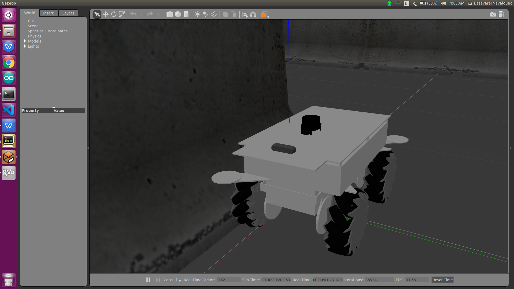
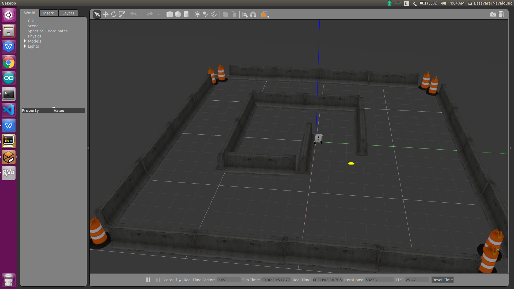
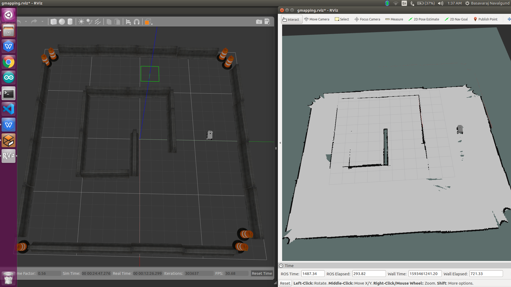
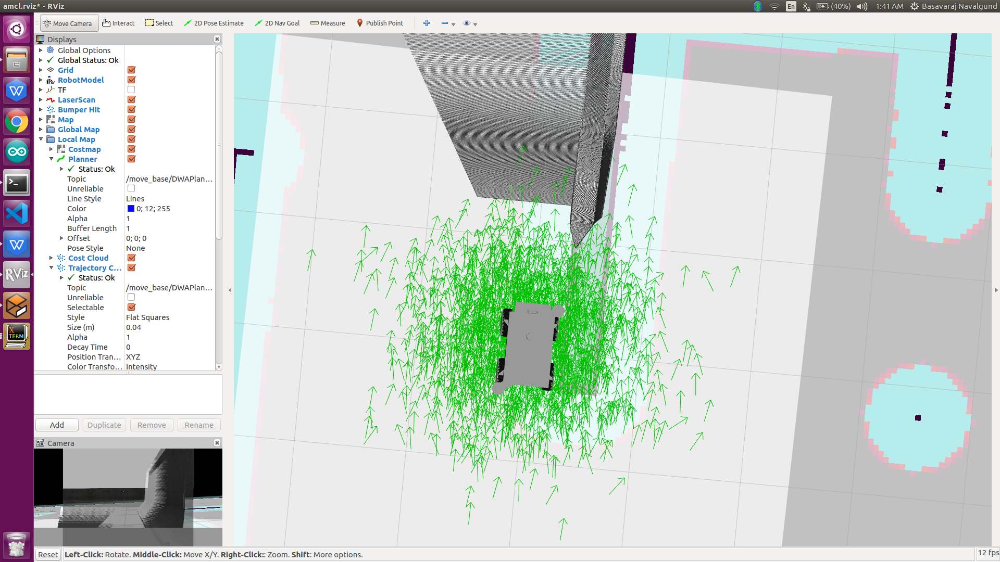

# WOrkplace Service Robot

#### Pre requisites

-  install gazebo 7+
-  ros kinetic

Install all the other required packages

		rosdep install --from-paths . --ignore-src -r -y 

### How to run the gazebo sim
-----------------------------------------------------

To perform SLAM with **gmapping**

	./test_slam.sh

To perform SLAM with **gmapping including obstacle avoidance**

	./obstacle_avoidance.sh

To launch **autonomous navigation**

	./test_navigation.sh
	

To launch **RVIZ**

	rviz

 

